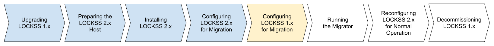

.. include:: subst.rst

====================================
Configuring LOCKSS 1.x for Migration
====================================

alling LOCKSS 2.x", and "Configuring LOCKSS 2.x for Migration", are colored in light blue, indicating completed steps. The fifth box labeled "Configuring LOCKSS 1.x for Migration" is highlighted in yellow, indicating the step in progress. The last two boxes, successively labeled "Running the Migrator" and "Reconfiguring LOCKSS 2.x for Normal Operation", are not colored, indicating future steps.

The next task is to configure LOCKSS 1.x for migration in the :guilabel:`Migration Settings` screen of your LOCKSS 1.x Web user interface.

Your LOCKSS 2.x system will need to be running, and you will need to know the LOCKSS 2.x hostname [#fn-same-host]_, Web user interface username and password, and PostgreSQL database password, supplied when :ref:`Configuring LOCKSS 2.x for Migration`.

.. tip::

   This phase occurs in the :guilabel:`Migration Settings` screen of your LOCKSS 1.x Web user interface. Some of the fields in this screen are passwords related to your newly installed LOCKSS 2.x instance. Web browsers pop up dialogs offering to save these LOCKSS 2.x passwords, but you should decline, as they would overwrite the password you may have saved for the LOCKSS 1.x Web UI.

Follow these steps:

1. Log in to your LOCKSS 1.x Web user interface, and click on :guilabel:`Migration Settings` in the top-right navigation menu.

   .. image:: laaws-migration-settings-navigation.png
      :align: center
      :alt: Screenshot of the LOCKSS 1.x Web user interface top-right navigation menu (in debug user mode), with a vertical succession of menu items: "AU Configuration", "Admin Access Control", "Content Access Control", "Content Access Options", "Proxy Info", "Daemon Status", "Migration Settings", "Migration Control", "Debug Panel", "Expert Config", "Title List", "Logs", "Thread Dump", "Contact Us", "My Account", "User Accounts", and "Help". A mouse cursor is hovering over the "Migration Settings" menu item.

2. Complete the four fields in the :guilabel:`LOCKSS 2.x Target` section of the screen using the appropriate LOCKSS 2.x values:

   a. :guilabel:`Hostname`: Enter the hostname of your LOCKSS 2.x host:

      *  :bdg-success:`new-host migration only` If you are doing a :ref:`New-Host Migration`, enter the LOCKSS 2.x hostname, for example :samp:`{lockss2.myuniversity.edu}`.

      *  :bdg-info:`same-host migration only` If you are doing a :ref:`Same-Host Migration`, enter ``localhost``.

   b. :guilabel:`Configuration Service Web UI Port`: The default Web UI port for the :external+lockss-manual:ref:`LOCKSS Configuration Service`, ``24602``, should remain unchanged.

   c. :guilabel:`Web UI Username`: Enter the Web UI username for the LOCKSS 2.x instance.

   d. :guilabel:`Web UI Password`: Enter the Web UI password for the LOCKSS 2.x instance.

3. Click the :guilabel:`Load Configuration` button. The metadata database configuration will be queried from the LOCKSS 2.x instance and displayed in the :guilabel:`Metadata Database` section of the screen.

4. In the :guilabel:`Database Password` field, enter the database password for the LOCKSS 2.x system.

5. :bdg-dark:`dry run migration only` If you are doing a :ref:`Dry Run Migration`, select the :guilabel:`Perform dry run migration` checkbox in the :guilabel:`Migration Options` section.

6.  :bdg-danger:`same-host migration with incremental reclamation only`

    **If, and only if,** you are doing a :ref:`Same-Host Migration With Incremental Reclamation`, select the :guilabel:`Delete each AU after migration` checkbox.

   .. caution::

      :bdg-danger:`same-host migration with incremental reclamation only`

      **Selecting this option will permanently delete content from your LOCKSS 1.x system, gradually during the migration as it progresses.** This option should be used **if, and only if,** you are doing a :ref:`Same-Host Migration With Incremental Reclamation`, which is only applicable if **neither** a :ref:`New-Host Migration` **nor** a :ref:`Same-Host Migration With Future Reclamation` are feasible. You will receive a popup warning when you check this checkbox, which you need to acknowledge before you can continue.

7. Click on the :guilabel:`Next` button to navigate to the :guilabel:`Migration Control` screen.

----

.. rubric:: Footnotes

.. [#fn-same-host]

   |FN_SAME_HOST|
