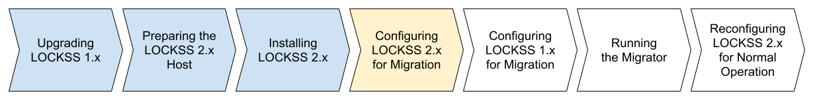

.. include:: subst.rst

====================================
Configuring LOCKSS 2.x for Migration
====================================

"Installing LOCKSS 2.x", are colored in light blue, indicating completed steps. The fourth box labeled "Configuring LOCKSS 2.x for Migration" is highlighted in yellow, indicating the step in progress. The last four boxes, successively labeled "Configuring LOCKSS 1.x for Migration", "Running the Migrator", "Reconfiguring LOCKSS 2.x for Normal Operation", and "Decommissioning LOCKSS 1.x", are not colored, indicating future steps.

The next task in the migration process is to configure LOCKSS 2.x for migration on your LOCKSS 2.x host.

---------------------------------------
Importing Configuration From LOCKSS 1.x
---------------------------------------

The first part of this task is to make your LOCKSS 1.x configuration file available to your LOCKSS 2.x instance.

This depends on your :ref:`Migration Scenario`:

.. tab-set::

   .. tab-item:: New-Host Migration
      :sync: newhost

      If you are doing a :ref:`New-Host Migration`:

      1. Copy the LOCKSS 1.x configuration file from :file:`/etc/lockss/config.dat` on your LOCKSS 1.x host to some file path on your LOCKSS 2.x host, symbolically represented here as :samp:`{/path/to/lockss1_config_file.dat}`. Although you can use any path on your LOCKSS 2.x host, we recommend :file:`/tmp/v1config.dat`.

         For example, you might use :program:`scp` on your LOCKSS 1.x host:

         :samp:`scp /etc/lockss/config.dat {<username>}@{<lockss2host>}:{/path/to/lockss1_config_file.dat}`

         or something similar.

         If you are unable to copy the LOCKSS 1.x configuration file to your LOCKSS 2.x, you can still configure LOCKSS 2.x for migration, but you will be prompted to supply more information, which you will have to enter accurately from the corresponding LOCKSS 1.x values.

      2. |LOCKSS2ROOT| Ensure that the LOCKSS 1.x configuration file :samp:`{/path/to/lockss1_config_file.dat}` is readable by all on the LOCKSS 2.x host. For example, you can do this as ``root`` on the LOCKSS 2.x host with:

         :samp:`chmod +r {/path/to/lockss1_config_file.dat}`

   .. tab-item:: Same-Host Migration
      :sync: samehost

      If you are doing a :ref:`Same-Host Migration`, the LOCKSS 2.x configuration script will find the LOCKSS 1.x configuration file directly at :file:`/etc/lockss/config.dat`, so you do not need to do anything in this step.

.. _Running configure-lockss --migrate:

---------------------------------------------
Running :program:`configure-lockss --migrate`
---------------------------------------------

The second part of this task is to run the :program:`configure-lockss` tool with the ``--migrate`` option on your LOCKSS 2.x host.

This will proceed largely as described in |TAB| Chapter |CONFIGURE_CHAPTER| (:external+lockss-manual:doc:`configuring`) of the |MANUAL|, **but with some notable exceptions described below**:

1. Follow the instructions in |TAB| Section |CONFIGURE_CHAPTER|.1 (:external+lockss-manual:ref:`Gathering Configuration Information`) of the |MANUAL|.

2. Follow these steps (**modified** from Section |CONFIGURE_CHAPTER|.2 of the |MANUAL|):

   a. |LOCKSS2LOCKSS| Navigate to the :ref:`LOCKSS Installer Directory`, symbolically:

      :samp:`cd {<LOCKSS_INSTALLER_DIR>}`

   b. |LOCKSS2LOCKSS| Run this command:

      *  |DRYRUNONLY| If you are doing a :ref:`Dry Run Migration`: ``scripts/configure-lockss``

      *  |ALLOTHERSCENARIOS| In all other cases: ``scripts/configure-lockss --migrate``

3. Follow the instructions in |TAB| Section |CONFIGURE_CHAPTER|.3 (:external+lockss-manual:ref:`Kubernetes Settings`) of the |MANUAL|.

4. This step depends on your :ref:`Migration Scenario`:

   .. tab-set::

      .. tab-item:: New-Host Migration
         :sync: newhost

         If you are doing a :ref:`New-Host Migration`, follow these steps:

         a. You will receive the following prompt:

            :guilabel:`Did you copy a LOCKSS 1.x config.dat file to this host?`

            Enter :kbd:`Y` for "yes" or :kbd:`N` for "no", or hit :kbd:`Enter` to accept the default in square brackets.

            *  If you enter :kbd:`Y` for "yes", you will then receive the following prompt:

               :guilabel:`Location of copied LOCKSS 1.x config.dat file`

               Enter the path of the copied LOCKSS 1.x configuration file, symbolically represented as :samp:`{/path/to/lockss1_config_file.dat}` above, or hit :kbd:`Enter` to accept the default in square brackets (:file:`/tmp/v1config.dat`).

            *  If you enter :kbd:`N` for "no", you will have to manually and accurately enter a number of values reflecting your LOCKSS 1.x configuration (instead of the values being imported directly from your copied LOCKSS 1.x configuration file).

         b. Follow all instructions in |TAB| Section |CONFIGURE_CHAPTER|.4 (:external+lockss-manual:ref:`Network Settings`) of the |MANUAL|.

      .. tab-item:: Same-Host Migration
         :sync: samehost

         If you are doing a :ref:`Same-Host Migration`, follow these steps:

         a. You will receive this message:

            ``Found /etc/lockss/config.dat``

            confirming that the LOCKSS 1.x configuration file was detected.

         b. Follow the instructions in the following sections of the |MANUAL|:

            *  |TAB| Section |CONFIGURE_CHAPTER|.4.1 (:external+lockss-manual:ref:`Hostname`)

            *  |TAB| Section |CONFIGURE_CHAPTER|.4.2 (:external+lockss-manual:ref:`IP Address`)

            *  |TAB| Section |CONFIGURE_CHAPTER|.4.3 (:external+lockss-manual:ref:`Initial UI Subnet`)

            *  |TAB| Section |CONFIGURE_CHAPTER|.4.4 (:external+lockss-manual:ref:`LCAP Port`)

         c. After the :guilabel:`LCAP protocol port` prompt, you will receive the following prompt:

            :guilabel:`Temporary LOCKSS 2.x LCAP port`

            Enter an LCAP port different from the one used by LOCKSS 1.x, for use during migration, or hit :kbd:`Enter` to accept the suggested value in square brackets.

         d. Follow the instructions in |TAB| Section |CONFIGURE_CHAPTER|.4.5 (:external+lockss-manual:ref:`Network Address Translation`) of the |MANUAL|.

5. Follow all instructions in the remainder of |TAB| Chapter |CONFIGURE_CHAPTER| of the |MANUAL|, namely |TAB| Section |CONFIGURE_CHAPTER|.5 (:external+lockss-manual:ref:`Mail Settings`) through |TAB| Section |CONFIGURE_CHAPTER|.12 (:external+lockss-manual:ref:`Final Steps of configure-lockss`).

------------------
Running LOCKSS 2.x
------------------

Now start the LOCKSS 2.x system. Follow these steps:

1. |LOCKSS2LOCKSS| Run the following command on your LOCKSS 2.x host (still as the ``lockss`` user, still in the :ref:`LOCKSS Installer Directory`):

   .. code-block:: shell

      scripts/start-lockss --wait

   If the startup process goes well, you will see:

   .. code-block:: text

      LOCKSS services are ready; AUs may still be loading.

   and control will be returned to the command line.

   .. tip::

      During this first startup, hundreds of megabytes of container images will be downloaded, which can take many minutes on a slow network.

2. This step depends on your :ref:`Migration Scenario`:

   .. tab-set::

      .. tab-item:: New-Host Migration
         :sync: newhost

         If you are doing a :ref:`New-Host Migration`, follow these steps:

         a. Log into the |CFGSVC| Web user interface as a way to verify that the LOCKSS 2.x stack has come up successfully. To do this, in a browser, go to the URL :samp:`http://{<lockss2host>}:24602/DaemonStatus`, where :samp:`{<lockss2host>}` represents the hostname of your LOCKSS 2.x host (for example ``lockss2.myuniversity.edu``), and log in using the Web user interface username and password you specified during the LOCKSS 2.x configuration process.

            *  If your browser is unable to connect, wait a moment and hit refresh until a Web user interface page is displayed.

            *  If your login is successful but the red warning "This LOCKSS box is still starting" is shown, wait a moment and hit refresh until it is gone.

         b. Once successful, click on :guilabel:`Admin Access Control` in the top-right navigation menu.

         c. If it is not covered by the entries in the :guilabel:`Allow Access` section, add the IP address of your LOCKSS 1.x host (so it will be allowed to connect to the LOCKSS 2.x Web user interface), then click the :guilabel:`Update` button to save.

      .. tab-item:: Same-Host Migration
         :sync: samehost

         If you are doing a :ref:`Same-Host Migration`, log into the |CFGSVC| Web user interface as a way to verify that the LOCKSS 2.x stack has come up successfully. To do this, in a browser, go to the URL :samp:`http://{<locksshost>}:24602/DaemonStatus`, where :samp:`{<locksshost>}` represents the hostname of your LOCKSS host (for example ``lockss.myuniversity.edu``), and log in using the Web user interface username and password you specified during the LOCKSS 2.x configuration process.

         *  If your browser is unable to connect, wait a moment and hit refresh until a Web user interface page is displayed.

         *  If your login is successful but the red warning "This LOCKSS box is still starting" is shown, wait a moment and hit refresh until it is gone.
