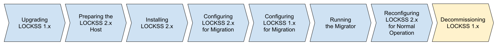

.. include:: subst.rst

==========================
Decommissioning LOCKSS 1.x
==========================

lling LOCKSS 2.x", "Configuring LOCKSS 2.x for Migration", "Configuring LOCKSS 1.x for Migration", "Running the Migrator", and "Reconfiguring LOCKSS 2.x for Normal Operation", are colored in light blue, indicating completed steps. The eighth box labeled "Decommissioning LOCKSS 1.x" is highlighted in yellow, indicating the step in progress.

The last task is to decommission your LOCKSS 1.x instance.

If you are doing a :ref:`New-Host Migration`, simply decommission the LOCKSS 1.x storage and host.

In the case of a :ref:`Same-Host Migration`, follow these cleanup steps:

1. Uninstall the LOCKSS 1.x software package and the LOCKSS Yum repository, with the following steps:

   a. |LOCKSS2ROOT| Run this Dnf command as ``root``:

      .. code-block:: shell

         dnf remove lockss-daemon

      This will uninstall the ``lockss-daemon`` (LOCKSS 1.x) software package.

   b. |LOCKSS2ROOT| Run this Dnf command as ``root``:

      .. code-block:: shell

         dnf config-manager --disablerepo lockss-repo

      This will disable the LOCKSS Yum repository.

   c. |LOCKSS2ROOT| As ``root``, run this command:

      .. code-block:: shell

         rm /etc/yum.d.repos/lockss.repo

      This will delete the configuration file that defines the LOCKSS Yum repository. (LOCKSS 2.x is not distributed via a Yum repository, so you will no longer need it, and it is being phased out.)

2. Reclaim the storage space used by LOCKSS 1.x log files, with the following steps:

   a. |LOCKSS2ROOT| Navigate to the LOCKSS 1.x log directory :file:`var/log/lockss` as ``root``:

      .. code-block:: shell

         cd /var/log/lockss

   b. |LOCKSS2ROOT| We recommend you save the LOCKSS 1.x to 2.x :ref:`Migration log files` into the ``lockss`` user's home directory for a little while, in case you need to refer to them soon after migration. Run this command as ``root``:

      .. code-block:: shell

         install -o lockss -g lockss v2migration.* ~lockss/

   b. |LOCKSS2ROOT| Run this command as ``root``:

      .. code-block:: shell

         rm daemon* stdout* v2migration.*

      This will free up the storage space used by LOCKSS 1.x log files.

3. |SAMEHOSTFUTUREONLY| If you are doing a :ref:`Same-Host Migration With Future Reclamation`, you can now free up the storage space formerly used by LOCKSS 1.x for preserved content. (If you are doing a :ref:`Same-Host Migration With Incremental Reclamation`, this was done gradually for you as the migration progressed and you do not need to do anything in this step.) For each content storage directory :file:`{<contentdir>}` your LOCKSS 1.x instance was configured to use, follow these steps:

   a. |LOCKSS2ROOT| Navigate to the :file:`{<contentdir>}` directory as ``root``:

      :samp:`cd {<contentdir>}`

   b. Delete its :file:`cache` subdirectory as ``root``:

      .. code-block:: shell

         rm -rf cache/

      This may take some time depending on the content size.

   Repeat for the next LOCKSS 1.x content storage directory until all :file:`cache` subdirectories of LOCKSS 1.x :file:`gamma` directories have been reclaimed.
