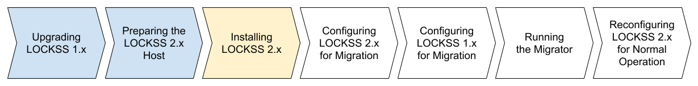

.. include:: subst.rst

=====================
Installing LOCKSS 2.x
=====================

e colored in light blue, indicating completed steps. The third box labeled "Installing LOCKSS 2.x" is highlighted in yellow, indicating the step in progress. The last five boxes, successively labeled "Configuring LOCKSS 2.x for Migration", "Configuring LOCKSS 1.x for Migration", "Running the Migrator", "Reconfiguring LOCKSS 2.x for Normal Operation", and "Decommissioning LOCKSS 1.x", are not colored, indicating future steps.

The next task in the migration process is to install LOCKSS |MIGRATE_TO_PATCH|, the latest version of LOCKSS |MIGRATE_TO_MINOR|, on your LOCKSS 2.x host [#fn-same-host]_.

The process depends on your :ref:`Migration Scenario`:

.. tab-set::

   .. tab-item:: New-Host Migration
      :sync: newhost

      |LOCKSS2ROOT|

      If you are doing a :ref:`New-Host Migration`, follow all instructions in |TAB| Chapter |INSTALL_CHAPTER| (:external+lockss-manual:ref:`Installing LOCKSS`) in the |MANUAL|, then return here.

   .. tab-item:: Same-Host Migration
      :sync: samehost

      |LOCKSS2ROOT|

      If you are doing a :ref:`Same-Host Migration`, follow the instructions in |TAB| Chapter |INSTALL_CHAPTER| (:external+lockss-manual:ref:`Installing LOCKSS`) in the |MANUAL|, **except** |TAB| Section |INSTALL_CHAPTER|.1.2 (:external+lockss-manual:ref:`Invoking adduser`), then return here.

----

.. rubric:: Footnotes

.. [#fn-same-host]

   If your :ref:`Migration Scenario` is a :ref:`Same-Host Migration`, your LOCKSS 1.x host and your LOCKSS 2.x host are the same host.
