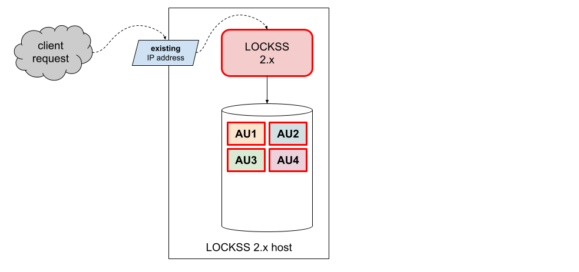
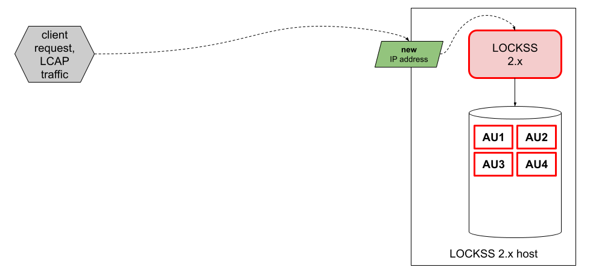

.. include:: subst.rst

=============================
Introduction to the Migration
=============================

-------------------------
Supported Migration Paths
-------------------------

As of the last update of this migration guide (|LASTUPDATED|), the only supported migration path is from LOCKSS |UPGRADE_FROM_PATCH| (the latest version of LOCKSS |UPGRADE_FROM_MINOR|) to LOCKSS |UPGRADE_TO_PATCH| (the latest version of LOCKSS |UPGRADE_TO_MINOR|). In particular, as of the twin release of LOCKSS |UPGRADE_FROM_MINOR| and LOCKSS |UPGRADE_TO_MINOR|, upgrades from earlier versions of LOCKSS 1.x and/or to earlier versions of LOCKSS 2.x are no longer supported.

------------------
Migration Overview
------------------

Conceptually, migration from LOCKSS 1.x to LOCKSS 2.x follows this outline:

1. An existing LOCKSS 1.x instance is preserving content in one or more content storage areas (legend [#fn-legend]_):

   .. image:: laaws-migration-overview-start.png
      :align: center

2. An empty LOCKSS 2.x instance is installed and configured (legend [#fn-legend]_):

   .. image:: laaws-migration-overview-before.png
      :align: center

3. .. _principal migration phase:

   The LOCKSS Migrator sets up and executes the migration, and the LOCKSS 2.x instance is gradually populated with the data from the LOCKSS 1.x instance. This is referred to as the **principal migration phase**. Each archival unit (AU) [#fn-au]_ becomes deactivated in the LOCKSS 1.x instance; then its contents are copied to the LOCKSS 2.x instance; finally the AU is reactivated in the LOCKSS 2.x instance (legend [#fn-legend]_):

   .. image:: laaws-migration-overview-middle.png
      :align: center

   The LOCKSS 1.x instance continues to act as the recipient of incoming requests (for example poll requests):

   *  Requests pertaining to AUs that have not been migrated yet (for example AU4 here) are handled directly by the LOCKSS 1.x instance (legend [#fn-legend]_):

      .. image:: laaws-migration-overview-middle4.png
         :align: center

   *  Requests pertaining to AUs that have been successfully migrated (for example AU2 here) are received by the LOCKSS 1.x instance and forwarded to the LOCKSS 2.x instance who handles it (legend [#fn-legend]_):

      .. image:: laaws-migration-overview-middle2.png
         :align: center

   *  Requests pertaining to AUs that are in the process of being migrated (for example AU3 here) are received by the LOCKSS 1.x instance and turned down (legend [#fn-legend]_):

      .. image:: laaws-migration-overview-middle3.png
         :align: center

4. At the end of the |PRINCIPAL|, the LOCKSS 2.x instance is handling all AUs, and the LOCKSS 1.x instance is no longer handling any AUs (legend [#fn-legend]_):

   .. image:: laaws-migration-overview-after.png
      :align: center

5. Finally, the LOCKSS 1.x instance is decommissioned (legend [#fn-legend]_):

   .. image:: laaws-migration-overview-end.png
      :align: center

The different :ref:`Migration Scenarios <Migration Scenario>` differ only in two key ways: where the LOCKSS 2.x instance is located compared to the LOCKSS 1.x instance, and when the storage space occupied by deactivated AUs from the LOCKSS 1.x instance is reclaimed.

------------------
Migration Scenario
------------------

.. |NEWHOSTMIGRATION| replace:: In this :ref:`Migration Scenario`, a newly-commissioned host with its own storage is used for the LOCKSS 2.x instance. After migration, the LOCKSS 1.x instance, its storage, and its host are decommissioned.

.. |SAMEHOSTMIGRATION| replace:: In this :ref:`Migration Scenario`, the LOCKSS 2.x instance is run on the existing host of the LOCKSS 1.x instance. After migration, the LOCKSS 1.x instance is decommissioned. If chosen, this scenario has two subtypes: a :ref:`Same-Host Migration With Future reclamation` if there is sufficient storage space to hold an entire LOCKSS 1.x and LOCKSS 2.x copy of the preserved content simultaneously (preferable), or a :ref:`Same-Host Migration With Incremental reclamation` if there is not.

.. |SAMEHOSTMIGRATIONQUALIFICATION| replace:: if a new-host migration is not feasible

.. |SAMEHOSTMIGRATIONFUTURE| replace:: In this :ref:`Same-Host Migration` scenario, the LOCKSS 2.x instance is configured to use different storage areas than the LOCKSS 1.x instance. After migration, the LOCKSS 1.x instance's storage areas are reclaimed all at once, and can then be devoted to the LOCKSS 2.x instance.

.. |SAMEHOSTMIGRATIONFUTUREQUALIFICATION| replace:: if a same-host migration is needed, and there is sufficient storage space to hold an entire LOCKSS 1.x and LOCKSS 2.x copy of the content simultaneously

.. |SAMEHOSTMIGRATIONINCREMENTAL| replace:: In this :ref:`Same-Host Migration` scenario, the LOCKSS 2.x instance is configured to use the same storage areas as the LOCKSS 1.x instance. The LOCKSS Migrator is operated in a mode in which the storage used by each AU in the LOCKSS 1.x instance is reclaimed after the AU is done migrating to the LOCKSS 2.x instance.

.. |SAMEHOSTMIGRATIONINCREMENTALQUALIFICATION| replace:: only if a same-host migration is needed, but there is insufficient storage space to hold an entire LOCKSS 1.x and LOCKSS 2.x copy of the content simultaneously

You may choose one of two migration scenarios:

*  :ref:`New-Host Migration` (**recommended**). |NEWHOSTMIGRATION|

*  :ref:`Same-Host Migration` (|SAMEHOSTMIGRATIONQUALIFICATION|). |SAMEHOSTMIGRATION|

New-Host Migration
==================

.. tip::

   This :ref:`Migration Scenario` is **recommended**.

|NEWHOSTMIGRATION|

An illustration of this scenario before, during, and after the |PRINCIPAL| is shown below:

a. .. image:: laaws-migration-new-host-before.png
      :align: center

b. .. image:: laaws-migration-new-host-middle3.png
      :align: center

c. .. image:: laaws-migration-new-host-after.png
      :align: center

.. note::

   At the end of the migration process, letting your LOCKSS 2.x host adopt the IP address and hostname previously associated with your LOCKSS 1.x is **strongly recommended**. See :numref:`Adopting the LOCKSS 1.x IP Address and Hostname` (:ref:`Adopting the LOCKSS 1.x IP Address and Hostname`).

.. _migration-new-host-recommended:

.. admonition:: Why is a new host recommended?

   *  LOCKSS 2.x has higher system requirements.

   *  Unlike LOCKSS 1.x, LOCKSS 2.x can be installed on a greater variety of :external+lockss-manual:ref:`Compatible Operating Systems`. This is an opportunity to move to a new host better fitting your institution's IT infrastructure preferences.

   *  If your LOCKSS 1.x host is running an outdated operating system in the RHEL family such as CentOS Linux 7, you must first upgrade the OS to another operating system in the RHEL family before proceeding with a same-host migration.

   *  Running LOCKSS 1.x and LOCKSS 2.x together on the same host will degrade performance, and may cause the migration process to take longer.

Same-Host Migration
===================

|SAMEHOSTMIGRATION|

Same-Host Migration With Future Reclamation
-------------------------------------------

|SAMEHOSTMIGRATIONFUTURE|

This migration scenario is used |SAMEHOSTMIGRATIONFUTUREQUALIFICATION|.

.. image:: laaws-migration-same-host-future-overview.png
   :align: center

Same-Host Migration With Incremental Reclamation
------------------------------------------------

|SAMEHOSTMIGRATIONINCREMENTAL|

This migration scenario is used |SAMEHOSTMIGRATIONINCREMENTALQUALIFICATION|.

The process is largely the same as that for a :ref:`Same-Host Migration With Future Reclamation`, except for a step in :numref:`Configuring LOCKSS 1.x for Migration` (:ref:`Configuring LOCKSS 1.x for Migration`).

.. image:: laaws-migration-same-host-incremental-overview.png
   :align: center

-----------------
Dry Run Migration
-----------------

It is possible to try out a :ref:`New-Host Migration` or a :ref:`Same-Host Migration With Future Reclamation` in **dry run mode**, meaning only for testing purposes without permanent changes to your LOCKSS 1.x system. (This is not possible for a :ref:`Same-Host Migration With Incremental Reclamation`.)

The process is largely the same as that for a corresponding :ref:`New-Host Migration` or :ref:`Same-Host Migration With Future Reclamation`, with a few differences highlighted as such in this guide:

*  A step in :numref:`Running configure-lockss --migrate` (:ref:`Running configure-lockss --migrate`) is slightly different for dry run migrations.

*  A step in :numref:`Configuring LOCKSS 1.x for Migration` (:ref:`Configuring LOCKSS 1.x for Migration`) is specific to dry run migrations.

*  At the end of experimentation, you will need to reset your LOCKSS 2.x instance to its initial state before performing a genuine migration.

   .. COMMENT FIXME How: reference to manual

---------------------
How To Use This Guide
---------------------

Chapters
========

This guide is organized in consecutive chapters (:numref:`Chapter %s <Upgrading LOCKSS 1.x>` through :numref:`Chapter %s <Decommissioning LOCKSS 1.x>`) representing the steps of the migration:

ling LOCKSS 2.x", "Configuring LOCKSS 2.x for Migration", "Configuring LOCKSS 1.x for Migration", "Running the Migrator", "Reconfiguring LOCKSS 2.x for Normal Operation", and "Decommissioning LOCKSS 1.x".

followed by some appendices.

LOCKSS 2.x System Manual References
===================================

Many parts of this guide accompany you as you apply sections of the |MANUAL|. To help identify cross-references to this complementary source of instructions, the symbol |TAB| is used to denote such references, for example:

    See |TAB| Section 1.2.3 in the |MANUAL|.

Parallel Sections
=================

In a number of places, the instructions differ somewhat between a :ref:`New-Host Migration` and a :ref:`Same-Host Migration`, and you will find parallel sections for each, like in this example:

    .. tab-set::

       .. tab-item:: New-Host Migration
          :sync: newhost

          Example of instructions specific to a :ref:`New-Host Migration`.

       .. tab-item:: Same-Host Migration
          :sync: samehost

          Example of instructions specific to a :ref:`Same-Host Migration`.

Scenario-Specific Instruction
=============================

If a single instruction step applies only to one :ref:`Migration Scenario` or to a :ref:`Dry Run Migration`, the following visuals will augment the text to that effect:

    *  |NEWHOSTONLY| This step applies only to a :ref:`New-Host Migration`.

    *  |SAMEHOSTONLY| This step applies only to a :ref:`Same-Host Migration` (either a :ref:`Same-Host Migration With Future Reclamation` or a :ref:`Same-Host Migration With Incremental Reclamation`).

    *  |SAMEHOSTFUTUREONLY| This step applies only to a :ref:`Same-Host Migration With Future Reclamation`.

    *  |SAMEHOSTINCREMENTALONLY| This step applies only to a :ref:`Same-Host Migration With Incremental Reclamation`.

    *  |DRYRUNONLY| This step applies only to a :ref:`Dry Run Migration`.

    *  |ALLOTHERSCENARIOS| If a step applies to only one :ref:`Migration Scenario`, this counterpart applies to all other scenarios.

Console Hint
============

The commands to be typed at the console at various points in the migration process will occur in several environments, in terms of host, user, and directory, and the following visuals will augment the text to that effect:

    *  |LOCKSS1ROOT| This command occurs on your LOCKSS 1.x host, as the ``root`` user.

    *  |LOCKSS2LOCKSS| This command occurs on your LOCKSS 2.x host, as the ``lockss`` user, in the :ref:`LOCKSS Installer Directory`.

    *  |LOCKSS2ROOT| This command occurs on your LOCKSS 2.x host, as the ``root`` user, in the :ref:`LOCKSS Installer Directory`.

.. rubric:: LOCKSS Installer Directory
   :name: LOCKSS Installer Directory
   :heading-level: 4

The **LOCKSS Installer Directory** is an important concept in LOCKSS 2.x. It is the directory from which many LOCKSS 2.x installation, configuration and operation commands are run -- usually as the ``lockss`` user, but in the case of installing LOCKSS 2.x for the first time, sometimes as the ``root`` user. The **default LOCKSS Installer Directory** is :file:`{$HOME}/lockss-installer` relative to the ``lockss`` user, meaning :file:`/home/lockss/lockss-installer` on most Linux systems. For complete details, see |TAB| :external+lockss-manual:ref:`LOCKSS Installer Directory` and |TAB| :external+lockss-manual:ref:`Default LOCKSS Installer Directory` in the |MANUAL|.

------------------------
Important Considerations
------------------------

Adopting the LOCKSS 1.x IP Address and Hostname
===============================================

|NEWHOSTONLY|

In a :ref:`New-Host Migration`, **it is strongly recommended that at the end, you allow your LOCKSS 2.x host to adopt the IP address, and ideally the hostname, previously associated with your LOCKSS 1.x host**:

This is an important consideration for planning purposes, because coordinated action with your system administrator or IT department to effect the change of IP addresses and/or hostnames may be required and may cause an interruption of service. Changing the IP address and hostname of the LOCKSS 2.x host occurs after the |PRINCIPAL|, at a designated step in :numref:`Chapter %s <Reconfiguring LOCKSS 2.x for Normal Operation>` (:ref:`Reconfiguring LOCKSS 2.x for Normal Operation`). At a high level, it consists of shutting down your LOCKSS 1.x host (or at least reconfiguring it to yet another IP address and hostname), reconfiguring your LOCKSS 2.x host so it uses the IP address (and ideally hostname) previously associated with your LOCKSS 1.x host, and restarting |K3S| to adjust to the newly configured IP address.

Not adopting the LOCKSS 1.x hostname, and especially IP address, has implications:

.. rubric:: Implications of not adopting the LOCKSS 1.x IP address
   :name: Implications of not adopting the LOCKSS 1.x IP address

If adopting the IP address of your LOCKSS 1.x host is not possible, there are implications for your LOCKSS network and its participants to a permanent change of IP address for your node:

   *  The administrator of your LOCKSS network will need to include the permanent change of IP address of your node in the LOCKSS network's configuration file, and make other  adjustments to the props server (firewall rules, Web server access rules, etc.) and more.

   *  Other nodes in your LOCKSS network may have to adjust firewall rules and other access control lists (for example in the :guilabel:`Content Access Options` section of the Web user interface).

.. rubric:: Implications of not adopting the LOCKSS 1.x hostname
   :name: Implications of not adopting the LOCKSS 1.x hostname

Adopting the hostname of your LOCKSS 1.x host is not strictly required for the node to function, but a change of hostname may also have downstream implications. If you keep the new hostname permanently, it will need to be used when accessing the Web user interface, and browser bookmarks, monitoring tools and dashboards, link resolvers (e.g. OpenURL resolvers), proxy configuration, etc. will need to be updated.

Firewall Rules
==============

FIXME

LCAP Over SSL
=============

FIXME

----

.. rubric:: Footnotes

.. [#fn-legend]

   Legend for the diagrams in :numref:`Migration Overview` (:ref:`Migration Overview`):

   .. image:: laaws-migration-overview-legend.png
      :alt: A legend for the diagrams in the Migration Overview section. A light blue chip and a vivid blue chip are described as "Related to LOCKSS 1.x". A light red chip and vivid red chip are described as "Related to LOCKSS 2.x". A box with a thick border labeled AU9 for "archival unit #9" is described as "Storage space currently occupied by an AU actively handled by the corresponding LOCKSS instance". A box with a thin border labeled AU9 for "archival unit #9" is described as "Storage space currently occupied by an AU formerly handled by the corresponding LOCKSS instance". A box with a dashed border labeled AU9 for "archival unit #9" is described as "Free storage space previously occupied by an AU formerly hanlded by the corresponding LOCKSS instance".

.. [#fn-au]

   An **archival unit**, or **AU**, is a unit of preserved content in LOCKSS. Consisting of any number of versioned objects, an AU might be a volume of a journal, a single book and its assets, a given digitized collection, etc.
