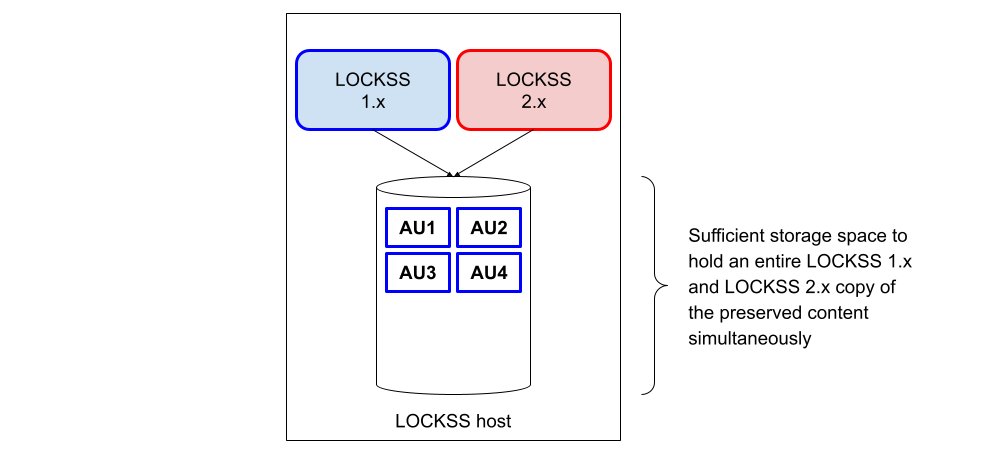
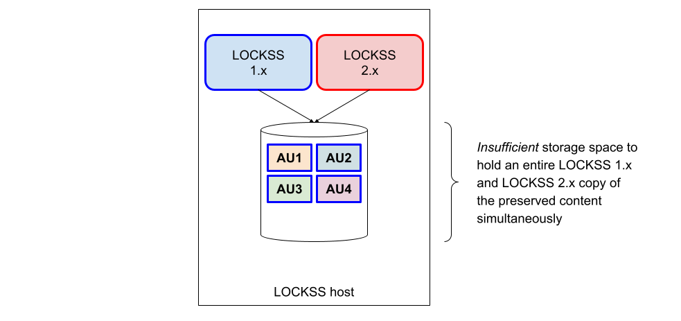

.. include:: subst.rst

=============================
Introduction to the Migration
=============================

-------------------------
Supported Migration Paths
-------------------------

As of the latest update of this migration guide (|LASTUPDATED|), the only supported migration path is from LOCKSS |MIGRATE_FROM_PATCH| (the latest version of LOCKSS |MIGRATE_FROM_MINOR|) to LOCKSS |MIGRATE_TO_PATCH| (the latest version of LOCKSS |MIGRATE_TO_MINOR|). In particular, as of the twin release of LOCKSS |MIGRATE_FROM_MINOR| and LOCKSS |MIGRATE_TO_MINOR|, upgrades from earlier versions of LOCKSS 1.x and/or to earlier versions of LOCKSS 2.x are no longer supported.

Additionally, migrating multiple LOCKSS 1.x instances into a single LOCKSS 2.x instance is not supported out of the box. If this is a situation you are considering (for example, if you have a LOCKSS 1.x instance for the Global LOCKSS Network and another for the USDocs project), please contact us for advice.

------------------
Migration Overview
------------------

Conceptually, migration from LOCKSS 1.x to LOCKSS 2.x follows this outline:

1. An existing LOCKSS 1.x instance is preserving content (legend [#fn-legend]_):

   .. image:: laaws-migration-overview-start.png
      :align: center

   A prerequisite is to bring the LOCKSS 1.x instance up to date first, which is covered in :numref:`Chapter %s <Upgrading LOCKSS 1.x>` (:ref:`Upgrading LOCKSS 1.x`).

2. An empty LOCKSS 2.x instance is installed and configured (legend [#fn-legend]_):

   .. image:: laaws-migration-overview-before.png
      :align: center

   This is covered in :numref:`Chapter %s <Preparing the LOCKSS 2.x Host>` (:ref:`Preparing the LOCKSS 2.x Host`), :numref:`Chapter %s <Installing LOCKSS 2.x>` (:ref:`Installing LOCKSS 2.x`), and :numref:`Chapter %s <Configuring LOCKSS 2.x for Migration>` (:ref:`Configuring LOCKSS 2.x for Migration`).

3. .. _principal migration phase:

   The LOCKSS Migrator sets up and executes the migration, and the LOCKSS 2.x instance is gradually populated with the data from the LOCKSS 1.x instance. This is referred to as the **principal migration phase**. This is covered in :numref:`Chapter %s <Configuring LOCKSS 1.x for Migration>` (:ref:`Configuring LOCKSS 1.x for Migration`) and :numref:`Chapter %s <Running the Migrator>` (:ref:`Running the Migrator`).

   At a high level, each archival unit (AU) [#fn-au]_ becomes "frozen" in the LOCKSS 1.x instance; then its contents are copied to the LOCKSS 2.x instance; finally the AU is reactivated in the LOCKSS 2.x instance (legend [#fn-legend]_):

   .. image:: laaws-migration-overview-middle.png
      :align: center

   At the end of the |PRINCIPAL|, the LOCKSS 2.x instance is handling all AUs, and the LOCKSS 1.x instance is no longer handling any AUs (legend [#fn-legend]_):

   .. image:: laaws-migration-overview-after.png
      :align: center

   .. dropdown:: Delegated AU handling during migration
      :name: Delegated AU handling during migration
      :icon: info
      :animate: fade-in-slide-down

      Until it is decommissioned and the LOCKSS 2.x instance takes over, the LOCKSS 1.x instance continues to act as the recipient of most client requests and |LCAP| traffic for all your preserved content -- except for a number of exceptions; see :numref:`Using LOCKSS During the Migration` (:ref:`Using LOCKSS During the Migration`) in :numref:`Chapter %s <Appendix: Instructions for Users of LOCKSS Nodes>` (:ref:`Appendix: Instructions for Users of LOCKSS Nodes`).

      Some operations, including |LCAP| traffic, are handled by the LOCKSS 1.x instance during migration, sometimes routing those requests to the LOCKSS 2.x instance as necessary:

      *  Client requests and |LCAP| traffic pertaining to AUs that have not been migrated yet (for example AU4 here) are handled directly by the LOCKSS 1.x instance (legend [#fn-legend]_):

         .. image:: laaws-migration-overview-middle4.png
            :align: center

      *  Client requests and |LCAP| traffic pertaining to AUs that have been successfully migrated (for example AU2 here) are received by the LOCKSS 1.x instance and forwarded to the LOCKSS 2.x instance who handles it (legend [#fn-legend]_):

         .. image:: laaws-migration-overview-middle2.png
            :align: center

      *  Client requests pertaining to AUs in the process of being migrated (for example AU3 here) are handled directly by the LOCKSS 1.x instance even while the AU is "frozen" (legend [#fn-legend]_):

         .. image:: laaws-migration-overview-middle3-yes.png
            :align: center

      *  |LCAP| traffic pertaining to AUs in the process of being migrated (for example AU3 here) is part of some of the functions that are unavailable while the AU is "frozen", and the LOCKSS 1.x instance who receives the request does not honor it (legend [#fn-legend]_):

         .. image:: laaws-migration-overview-middle3-no.png
            :align: center

4. Finally, the LOCKSS 1.x instance is decommissioned (legend [#fn-legend]_) and the LOCKSS 2.x instance takes over:

   .. image:: laaws-migration-overview-end.png
      :align: center

   This is covered in :numref:`Chapter %s <Reconfiguring LOCKSS 2.x for Normal Operation>` (:ref:`Reconfiguring LOCKSS 2.x for Normal Operation`) and :numref:`Chapter %s <Decommissioning LOCKSS 1.x>` (:ref:`Decommissioning LOCKSS 1.x`).

The different :ref:`Migration Scenarios <Migration Scenario>` differ only in two key ways: where the LOCKSS 2.x instance is located compared to the LOCKSS 1.x instance, and when the storage space occupied by deactivated AUs from the LOCKSS 1.x instance is reclaimed.

------------------
Migration Scenario
------------------

.. |NEWHOSTMIGRATION| replace:: In this :ref:`Migration Scenario`, a newly-commissioned host with its own storage is used for the LOCKSS 2.x instance. After migration, the LOCKSS 1.x instance, its storage, and its host are decommissioned.

.. |SAMEHOSTMIGRATION| replace:: In this :ref:`Migration Scenario`, the LOCKSS 2.x instance is run on the existing host along with the LOCKSS 1.x instance. After migration, the LOCKSS 1.x instance is decommissioned. If chosen, this scenario has two subtypes: a :ref:`Same-Host Migration With Future reclamation` if there is sufficient storage space to hold an entire LOCKSS 1.x and LOCKSS 2.x copy of the preserved content simultaneously (preferable), or a :ref:`Same-Host Migration With Incremental reclamation` if there is not.

.. |SAMEHOSTMIGRATIONFUTURE| replace:: This :ref:`Same-Host Migration` scenario applies when there is sufficient storage space to hold an entire LOCKSS 1.x and LOCKSS 2.x copy of the preserved content simultaneously. After the entire migration is complete, the storage space formerly used by the LOCKSS 1.x instance is reclaimed.

.. |SAMEHOSTMIGRATIONINCREMENTAL| replace:: This :ref:`Same-Host Migration` scenario applies only when there is *insufficient* storage space to hold an entire LOCKSS 1.x and LOCKSS 2.x copy of the preserved content simultaneously. The LOCKSS Migrator is operated in a mode in which the storage used by each AU in the LOCKSS 1.x instance is reclaimed after the AU is done migrating to the LOCKSS 2.x instance.

You may choose one of two migration scenarios:

*  :ref:`New-Host Migration` (**recommended**). |NEWHOSTMIGRATION|

*  :ref:`Same-Host Migration`. |SAMEHOSTMIGRATION|

New-Host Migration
==================

.. _migration-new-host-recommended:

.. tip::

   **This migration scenario is recommended.**

   .. _Why is a new-host migration recommended?:

   .. admonition:: Why is a new-host migration recommended?

      *  LOCKSS 2.x has higher system requirements.

      *  Unlike LOCKSS 1.x, LOCKSS 2.x can be installed on a greater variety of :external+lockss-manual:ref:`Compatible Operating Systems`. This is an opportunity to move to a new host better fitting your institution's IT infrastructure preferences.

      *  If your LOCKSS 1.x host is running an outdated operating system in the RHEL family such as CentOS Linux 7, you must first upgrade the OS to another operating system in the RHEL family before proceeding with a same-host migration.

      *  Running LOCKSS 1.x and LOCKSS 2.x together on the same host will degrade performance, and may cause the migration process to take longer.

|NEWHOSTMIGRATION|

.. dropdown:: Step by step illustration of a new-host migration
   :name: Step by step illustration of a new-host migration
   :icon: info
   :animate: fade-in-slide-down

   An illustration of this scenario before, during, and after the |PRINCIPAL| is shown below (legend [#fn-legend]_):

   a. .. image:: laaws-migration-new-host-before.png
         :align: center

   b. .. image:: laaws-migration-new-host-middle3.png
         :align: center

   c. .. image:: laaws-migration-new-host-after.png
         :align: center

Same-Host Migration
===================

|SAMEHOSTMIGRATION|

This :ref:`Migration Scenario` is used when a :ref:`New-Host Migration` is not feasible.

If unsure about how much spare storage space is needed to choose the right :ref:`Same-Host Migration` or if you are close to not having quite enough spare space for two copies, contact us for adivce.

Same-Host Migration With Future Reclamation
-------------------------------------------

.. tip::

   If a :ref:`Same-Host Migration` is needed, this scenario is preferable to a :ref:`Same-Host Migration With Incremental Reclamation`.

|SAMEHOSTMIGRATIONFUTURE|

.. dropdown:: Step by step illustration of a same-host migration with future reclamation
   :name: Step by step illustration of a same-host migration with future reclamation
   :icon: info
   :animate: fade-in-slide-down

   An illustration of this scenario before, during, and after the |PRINCIPAL| is shown below (legend [#fn-legend]_):

   a. .. image:: laaws-migration-same-host-future-before.png
         :align: center

   b. .. image:: laaws-migration-same-host-future-middle3.png
         :align: center

   c. .. image:: laaws-migration-same-host-future-after.png
         :align: center

   d. .. image:: laaws-migration-same-host-future-end.png
         :align: center

Same-Host Migration With Incremental Reclamation
------------------------------------------------

|SAMEHOSTMIGRATIONINCREMENTAL|

Procedurally, the process is the same as that for a :ref:`Same-Host Migration With Future Reclamation`, except for one particular step in :numref:`Configuring LOCKSS 1.x for Migration` (:ref:`Configuring LOCKSS 1.x for Migration`).

.. dropdown:: Step by step illustration of a same-host migration with incremental reclamation
   :name: Step by step illustration of a same-host migration with incremental reclamation
   :icon: info
   :animate: fade-in-slide-down

   An illustration of this scenario before, during, and after the |PRINCIPAL| is shown below (legend [#fn-legend]_):

   a. .. image:: laaws-migration-same-host-incremental-before.png
         :align: center

   b. .. image:: laaws-migration-same-host-incremental-middle1.png
         :align: center

   c. .. image:: laaws-migration-same-host-incremental-middle2.png
         :align: center

   d. .. image:: laaws-migration-same-host-incremental-middle3.png
         :align: center

   e. .. image:: laaws-migration-same-host-incremental-middle4.png
         :align: center

   f. .. image:: laaws-migration-same-host-incremental-after.png
         :align: center

   g. .. image:: laaws-migration-same-host-incremental-end.png
         :align: center

-----------------
Dry Run Migration
-----------------

It is possible to try out a :ref:`New-Host Migration` or a :ref:`Same-Host Migration With Future Reclamation` in **dry run mode**, meaning only for testing purposes without permanent changes to your LOCKSS 1.x system. (This is not possible for a :ref:`Same-Host Migration With Incremental Reclamation`.)

The process is largely the same as that for a corresponding :ref:`New-Host Migration` or :ref:`Same-Host Migration With Future Reclamation`, with a few differences highlighted as such in this guide:

*  A step in :numref:`Running configure-lockss --migrate` (:ref:`Running configure-lockss --migrate`) is slightly different for dry run migrations.

*  A step in :numref:`Configuring LOCKSS 1.x for Migration` (:ref:`Configuring LOCKSS 1.x for Migration`) is specific to dry run migrations.

*  At the end of experimentation, you will need to reset your LOCKSS 2.x instance to its initial state before performing a genuine migration. See |TAB| :external+lockss-manual:ref:`Resetting the System to a Blank State` in the |MANUAL|.

---------------------
How To Use This Guide
---------------------

Chapters
========

This guide is organized in consecutive chapters (:numref:`Chapter %s <Upgrading LOCKSS 1.x>` through :numref:`Chapter %s <Decommissioning LOCKSS 1.x>`) representing the steps of the migration:

.. image:: laaws-migration-steps-start.png
   :align: center
   :alt: A diagram of eight consecutive arrow-shaped boxes, representing from left to right the steps of the migration workflow from LOCKSS 1.x to LOCKSS 2.x. The eight boxes are successively labeled "Upgrading LOCKSS 1.x", "Preparing the LOCKSS 2.x Host", "Installing LOCKSS 2.x", "Configuring LOCKSS 2.x for Migration", "Configuring LOCKSS 1.x for Migration", "Running the Migrator", "Reconfiguring LOCKSS 2.x for Normal Operation", and "Decommissioning LOCKSS 1.x".

followed by some appendices.

LOCKSS 2.x System Manual References
===================================

Many parts of this guide accompany you as you apply sections of the |MANUAL|. To help identify cross-references to this complementary source of instructions, the symbol |TAB| is used to denote such references, for example:

    See |TAB| Section 1.2.3 in the |MANUAL|.

Parallel Sections
=================

In a number of places, the instructions differ somewhat between a :ref:`New-Host Migration` and a :ref:`Same-Host Migration`, and you will find parallel sections for each, like in this example:

    .. tab-set::

       .. tab-item:: New-Host Migration
          :sync: newhost

          Example of instructions specific to a :ref:`New-Host Migration`.

       .. tab-item:: Same-Host Migration
          :sync: samehost

          Example of instructions specific to a :ref:`Same-Host Migration`.

Scenario-Specific Instruction
=============================

If a single instruction step applies only to one :ref:`Migration Scenario` or to a :ref:`Dry Run Migration`, the following visuals will augment the text to that effect:

    *  |NEWHOSTONLY| This step applies only to a :ref:`New-Host Migration`.

    *  |SAMEHOSTONLY| This step applies only to a :ref:`Same-Host Migration` (either a :ref:`Same-Host Migration With Future Reclamation` or a :ref:`Same-Host Migration With Incremental Reclamation`).

    *  |SAMEHOSTFUTUREONLY| This step applies only to a :ref:`Same-Host Migration With Future Reclamation`.

    *  |SAMEHOSTINCREMENTALONLY| This step applies only to a :ref:`Same-Host Migration With Incremental Reclamation`.

    *  |DRYRUNONLY| This step applies only to a :ref:`Dry Run Migration`.

    *  |ALLOTHERSCENARIOS| If a step applies to only one :ref:`Migration Scenario`, this counterpart applies to all other scenarios.

Console Hint
============

The commands to be typed at the console at various points in the migration process will occur in several environments, in terms of host, user, and directory, and the following visuals will augment the text to that effect:

    *  |LOCKSS1ROOT| This command occurs on your LOCKSS 1.x host, as the ``root`` user.

    *  |LOCKSS2LOCKSS| This command occurs on your LOCKSS 2.x host, as the ``lockss`` user, in the :ref:`LOCKSS Installer Directory`.

    *  |LOCKSS2ROOT| This command occurs on your LOCKSS 2.x host, as the ``root`` user, in the :ref:`LOCKSS Installer Directory`.

.. rubric:: LOCKSS Installer Directory
   :name: LOCKSS Installer Directory
   :heading-level: 4

The **LOCKSS Installer Directory** is an important concept in LOCKSS 2.x. It is the directory from which many LOCKSS 2.x installation, configuration and operation commands are run -- usually as the ``lockss`` user, but in the case of installing LOCKSS 2.x for the first time, sometimes as the ``root`` user. The **default LOCKSS Installer Directory** is :file:`{$HOME}/lockss-installer` relative to the ``lockss`` user, meaning :file:`/home/lockss/lockss-installer` on most Linux systems. For complete details, see |TAB| :external+lockss-manual:ref:`LOCKSS Installer Directory` and |TAB| :external+lockss-manual:ref:`Default LOCKSS Installer Directory` in the |MANUAL|.

Coordinating with Administrators of LOCKSS Networks
===================================================

This guide is primarily aimed at operators of individual LOCKSS nodes, but **some actions must be performed by administrators of LOCKSS networks through the transitional period of migration of the nodes from LOCKSS 1.x to 2.x** (before any node migrates, before and after each node migrates, and after all nodes migrate). Information for administrators of LOCKSS networks can be found in :numref:`Chapter %s <Appendix: Instructions for Administrators of LOCKSS Networks>` (:ref:`Appendix: Instructions for Administrators of LOCKSS Networks`), but throughout this guide, hints to coordinate with them are highlighted in the appropriate places like this:

    .. admonition:: Coordinating with Administrators of LOCKSS Networks

      Example of a hint to coordinate with the administrator of your LOCKSS network. See :numref:`Chapter %s <Appendix: Instructions for Administrators of LOCKSS Networks>` (:ref:`Appendix: Instructions for Administrators of LOCKSS Networks`).

Containerized LOCKSS 1.x
========================

A few additional instructions apply only in the unlikely event you are running LOCKSS 1.x as a Docker container. These additional instructions are marked with this special visual:

    |LOCKSS1CONTAINER| This step applies only if you are running LOCKSS 1.x as a Docker container.

------------------------
Important Considerations
------------------------

Adopting the LOCKSS 1.x IP Address
==================================

|NEWHOSTONLY|

The |LCAP| identity of a LOCKSS node in a LOCKSS network is predicated in part on the node's IP address. A :ref:`New-Host Migration` automatically involves a new IP address for the LOCKSS 2.x host during the migration, which you might be tempted to keep long term.

Near the end of the migration, in the designated :ref:`New-Host Migration` step in :numref:`Chapter %s <Reconfiguring LOCKSS 2.x for Normal Operation>` (:ref:`Reconfiguring LOCKSS 2.x for Normal Operation`), **it is strongly recommended that you allow your LOCKSS 2.x host to adopt the IP address previously associated with your LOCKSS 1.x host**.

.. note::

   If adopting the IP address of your LOCKSS 1.x host is not possible, there are implications for the administrator of your LOCKSS network and the other nodes in your network. See :ref:`Change of LCAP Identity` in :numref:`Chapter %s <Appendix: Instructions for Administrators of LOCKSS Networks>` (:ref:`Appendix: Instructions for Administrators of LOCKSS Networks`).

Adopting the LOCKSS 1.x LCAP Port
=================================

Likewise, the |LCAP| identity of a LOCKSS node in a LOCKSS network is predicated in part on the node's |LCAP| (LOCKSS audit and repair protocol) port. A :ref:`Same-Host Migration` automatically involves a secondary |LCAP| port for the LOCKSS 2.x during the migration which you might be tempted to keep long term. Additionally, all migrations involve :ref:`Configuring LOCKSS 2.x for Migration` and :ref:`Reconfiguring LOCKSS 2.x for Normal Operation`, where you might be tempted to choose a different primary |LCAP| port than your LOCKSS 1.x instance.

Near the end of the migration, in the designated step in :numref:`Chapter %s <Reconfiguring LOCKSS 2.x for Normal Operation>` (:ref:`Reconfiguring LOCKSS 2.x for Normal Operation`), **it is strongly recommended that you allow your LOCKSS 2.x host to adopt the LCAP port previously associated with your LOCKSS 1.x host**.

.. note::

   If adopting the |LCAP| port of your LOCKSS 1.x host is not possible, there are implications for the administrator of your LOCKSS network. See :ref:`Change of LCAP Identity` in :numref:`Chapter %s <Appendix: Instructions for Administrators of LOCKSS Networks>` (:ref:`Appendix: Instructions for Administrators of LOCKSS Networks`). Additionally, there are implications for your firewall infrastructure.

Adopting the LOCKSS 1.x Hostname
================================

|NEWHOSTONLY|

Similarly to the IP address, a :ref:`New-Host Migration` automatically involves a new hostname for the LOCKSS 2.x host during the migration, which you might be tempted to keep long term. Adopting the hostname of your LOCKSS 1.x host at the end of the migration is not strictly required for the LOCKSS 2.x to function, but it is **recommended**.

.. note::

   If adopting the hostname of your LOCKSS 1.x host is not possible, there are implications for accessing the Web user interface, and browser bookmarks, monitoring tools and dashboards, link resolvers (e.g. OpenURL resolvers), proxy configuration, etc. will need to be updated.

LCAP Over SSL
=============

If your LOCKSS network uses SSL keystores for encrypted |LCAP| communication between nodes, you will need to perform a few additional steps related to your LCAP SSL keystore during the migration of your node. Ask your LOCKSS network administrator if this situation applies to you, and if so, contact us for further advice.

----

.. rubric:: Footnotes

.. [#fn-legend]

   Legend for the diagrams in :numref:`Migration Overview` (:ref:`Migration Overview`) and :numref:`Migration Scenario` (:ref:`Migration Scenario`):

   .. image:: laaws-migration-overview-legend.png
      :alt: A legend for the diagrams in the Migration Overview section. A light blue chip and a vivid blue chip are described as "Related to LOCKSS 1.x". A light red chip and vivid red chip are described as "Related to LOCKSS 2.x". A box with a thick border labeled AU9 for "archival unit #9" is described as "Storage space currently occupied by an AU actively handled by the corresponding LOCKSS instance". A box with a thin border labeled AU9 for "archival unit #9" is described as "Storage space currently occupied by an AU formerly handled by the corresponding LOCKSS instance". A box with a dashed border labeled AU9 for "archival unit #9" is described as "Free storage space previously occupied by an AU formerly hanlded by the corresponding LOCKSS instance".

.. [#fn-au]

   An **archival unit**, or **AU**, is a unit of preserved content in LOCKSS. Consisting of any number of versioned objects, an AU might be a volume of a journal, a single book and its assets, a given digitized collection, etc.
