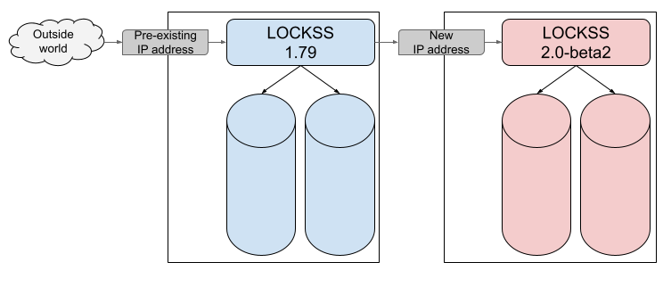
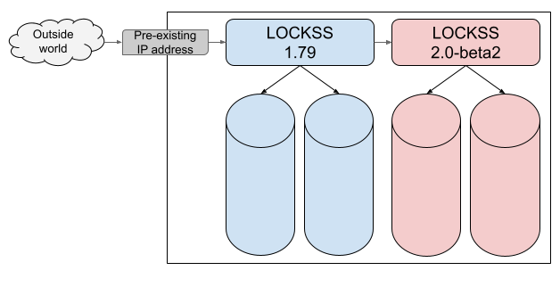
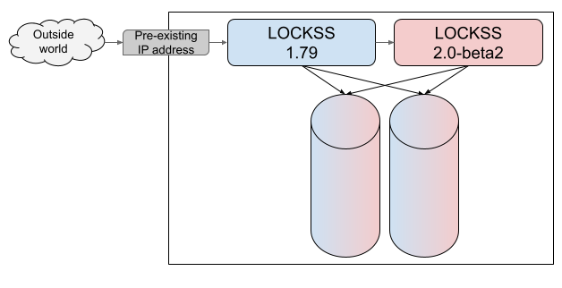

==================
Migration Overview
==================

------------------------
Basic Migration Overview
------------------------

Conceptually, migration from LOCKSS |UPGRADE_FROM_MINOR| to LOCKSS |UPGRADE_TO_MINOR| follows this outline:

1. A pre-existing LOCKSS |UPGRADE_FROM_MINOR| instance is preserving content in one or more content storage areas (key [#fn-key]_):

   .. image:: laaws-migration-basic-before.png
      :align: center
      :alt: Diagram showing a blue LOCKSS |UPGRADE_FROM_MINOR| box with arrows pointing at two blue disks representing its content storage areas. Boxes with bold labels "AU #1", "AU #2" and "AU #3" appear on the first blue disk, and boxes with bold labels "AU #4", "AU #5" and "AU #6" appear on the second blue disk. This illustrates that all AUs are handled by the LOCKSS |UPGRADE_FROM_MINOR| instance.

2. An empty LOCKSS |UPGRADE_TO_MINOR| instance is configured with one or more content storage areas of its own (key [#fn-key]_):

   .. image:: laaws-migration-basic-start.png
      :align: center
      :alt: Diagram showing a blue LOCKSS |UPGRADE_FROM_MINOR| box with arrows pointing at two blue disks representing its content storage areas, side by side with a red LOCKSS |UPGRADE_TO_MINOR| box with arrows pointing at two red disks representing its content storage areas. Boxes with bold labels "AU #1", "AU #2" and "AU #3" appear on the first blue disk, and boxes with bold labels "AU #4", "AU #5" and "AU #6" appear on the second blue disk. Nothing appears on the red disks. This illustrates that all AUs are handled by the LOCKSS |UPGRADE_FROM_MINOR| instance and that the LOCKSS |UPGRADE_TO_MINOR| instance is empty.

3. The LOCKSS migrator sets up and executes the migration, and the LOCKSS |UPGRADE_TO_MINOR| instance is gradually populated with the data from the LOCKSS |UPGRADE_FROM_MINOR| instance. Each archival unit (AU) [#fn-au]_ becomes deactivated in the LOCKSS |UPGRADE_FROM_MINOR| instance; then its contents are copied to the LOCKSS |UPGRADE_TO_MINOR| instance; finally the AU is reactivated in the LOCKSS |UPGRADE_TO_MINOR| instance (key [#fn-key]_):

   .. image:: laaws-migration-basic-middle.png
      :align: center
      :alt: Diagram showing a blue LOCKSS |UPGRADE_FROM_MINOR| box with arrows pointing at two blue disks representing its content storage areas, side by side with a red LOCKSS |UPGRADE_TO_MINOR| box with arrows pointing at two red disks representing its content storage areas. A box with a non-bold label "AU #1" appears on the first blue disk, and a corresponding box with a bold label "AU #1" appears on the first red disk. A box with a non-bold label "AU #2" appears on the first blue disk, and a corresponding box with a bold label "AU #2" appears on the second red disk. A box with a non-bold label "AU #3" appears on the first blue disk, and a corresponding box with a bold label "AU #3" appears on the first red disk. A box with a non-bold label "AU #4" appears on the second blue disk, and another corresponding box with a non-bold label "AU #4" appears on the second red disk; additionally, an arrow with the text "AU #4 migration in progress" goes from the LOCKSS |UPGRADE_FROM_MINOR| box to the LOCKSS |UPGRADE_TO_MINOR| box. Boxes with bold labels "AU #5" and "AU #6" appear on the second blue disk, with no corresponding boxes appearing on the red disks. AU #1, AU #2 and AU #3 illustrate AUs that have been migrated; they are no longer handled by the LOCKSS |UPGRADE_FROM_MINOR| instance but still occupy disk space, and they are handled by the the LOCKSS |UPGRADE_TO_MINOR| instance. AU #4 illustrates a migration in progress; it is not handled by either instance. AU #5 and AU #6 illustrate AUs that have not yet been migrated; they are handled by the LOCKSS |UPGRADE_FROM_MINOR| instance, and do not yet occupy any disk space associated with the LOCKSS |UPGRADE_TO_MINOR| instance. The diagram also illustrates that corresponding AUs may not be distributed the same way on the blue disks and the red disks.

4. At the end of the migration process, the LOCKSS |UPGRADE_TO_MINOR| instance is handling all AUs, and the LOCKSS |UPGRADE_FROM_MINOR| instance is no longer handling any AUs (key [#fn-key]_):

   .. image:: laaws-migration-basic-end.png
      :align: center
      :alt: Diagram showing a blue LOCKSS |UPGRADE_FROM_MINOR| box with arrows pointing at two blue disks representing its content storage areas, side by side with a red LOCKSS |UPGRADE_TO_MINOR| box with arrows pointing at two red disks representing its content storage areas. Boxes with non-bold labels "AU #1", "AU #2" and "AU #3" appear on the first blue disk, and boxes with non-bold labels "AU #4", "AU #5" and "AU #6" appear on the second blue disk. Boxes with bold labels "AU #1", "AU #3" and "AU #5" appear on the first red disk, and boxes with bold labels "AU #2", "AU #4" and "AU #6" appear on the second red disk. This illustrates that all AUs are handled by the LOCKSS |UPGRADE_TO_MINOR| instance and that the LOCKSS |UPGRADE_TO_MINOR| instance is no longer handling any AUs, although the disk space used by the AUs formerly is still occupied.

5. Finally, the LOCKSS |UPGRADE_FROM_MINOR| instance is decommissioned (key [#fn-key]_):

   .. image:: laaws-migration-basic-after.png
      :align: center
      :alt: Diagram showing a red LOCKSS |UPGRADE_TO_MINOR| box with arrows pointing at two red disks representing its content storage areas. Boxes with bold labels "AU #1", "AU #3" and "AU #5" appear on the first red disk, and boxes with bold labels "AU #2", "AU #4" and "AU #6" appear on the second red disk. This illustrates that all AUs are handled by the LOCKSS |UPGRADE_TO_MINOR| instance.

The different :ref:`Migration Scenarios <Migration Scenario>` differ only in two key ways: where the LOCKSS |UPGRADE_TO_MINOR| instance is located compared to the LOCKSS |UPGRADE_FROM_MINOR| instance, and when the storage space occupied by deactivated AUs from the LOCKSS |UPGRADE_FROM_MINOR| instance is reclaimed.

------------------
Migration Scenario
------------------

.. |NEWHOSTMIGRATION| replace:: In this migration scenario, a newly-commissioned host with its own storage is used for the LOCKSS |UPGRADE_TO_MINOR| instance. After migration, the LOCKSS |UPGRADE_FROM_MINOR| instance, its storage, and its host are decommissioned.

.. |SAMEHOSTMIGRATION| replace:: In this migration scenario, the LOCKSS |UPGRADE_TO_MINOR| instance is run on the pre-existing host of the LOCKSS |UPGRADE_FROM_MINOR| instance. After migration, the LOCKSS |UPGRADE_FROM_MINOR| instance is decommissioned.

.. |SAMEHOSTMIGRATIONFUTURE| replace:: In this :ref:`Same-Host Migration` scenario, the LOCKSS |UPGRADE_TO_MINOR| instance is configured to use different storage areas than the LOCKSS |UPGRADE_FROM_MINOR| instance. After migration, the LOCKSS |UPGRADE_FROM_MINOR| instance's storage areas are reclaimed all at once, and can then be devoted to the LOCKSS |UPGRADE_TO_MINOR| instance.

.. |SAMEHOSTMIGRATIONINCREMENTAL| replace:: In this :ref:`Same-Host Migration` scenario, the LOCKSS |UPGRADE_TO_MINOR| instance is configured to use the same storage areas as the LOCKSS |UPGRADE_FROM_MINOR| instance. The LOCKSS Migrator is operated in a special mode in which the storage used by each AU in the LOCKSS |UPGRADE_FROM_MINOR| instance is reclaimed after the AU is done migrating to the LOCKSS |UPGRADE_TO_MINOR| instance.

*  :ref:`New-Host Migration` (**recommended**). |NEWHOSTMIGRATION|

*  :ref:`Same-Host Migration` (*if a new-host migration is not feasible*). |SAMEHOSTMIGRATION| This scenario has two subtypes:

   *  :ref:`Same-Host Migration With Future Reclamation` (*preferable if a same-host migration is needed*). |SAMEHOSTMIGRATIONFUTURE|

   *  :ref:`Same-Host Migration With Incremental Reclamation` (*if a same-host migration is needed but a same-host migration with future reclamation is not feasible*). |SAMEHOSTMIGRATIONINCREMENTAL|

New-Host Migration
==================

FIXME

Same-Host Migration
===================

FIXME

Same-Host Migration With Future Reclamation
-------------------------------------------

FIXME

Same-Host Migration With Incremental Reclamation
------------------------------------------------

FIXME

.. _migration-new-host-recommended:

.. admonition:: Why is a new host recommended?

   *  LOCKSS 2.x has higher system requirements.

   *  Unlike LOCKSS 1.x, LOCKSS 2.x can be installed on a great variety of operating systems. This is an opportunity to move to a new host better fitting your institution's IT infrastructure preferences.

   *  Running LOCKSS 1.x and LOCKSS 2.x together on the same host will degrade performance and cause the migration process to take longer.

   *  If your LOCKSS 1.x host is running an outdated operating system such as CentOS 7, you would have to upgrade the OS before proceeding with a same-host migration.

---------------------------
Detailed Migration Overview
---------------------------

.. sidebar:: TL;DR

   *  The LOCKSS 1.x to 2.x migration tool is operated from the LOCKSS 1.x Web UI.

   *  During migration, continue to access content (ServeContent, proxy) using the 1.x host and port.

   *  During migration, additional AUs to be preserved and subscriptions should be added using the 2.x Web UI.

   *  During migration, changes to configuration, such as IP access lists and proxy settings, should be made to both the 1.x and 2.x systems.

The LOCKSS migration process provides a way to copy content and configuration from LOCKSS 1.x to LOCKSS 2.x. It requires that both the 1.x and the 2.x systems be running simultaneously, either on the same or on different hosts. The migrator is a 1.x component which talks to the 2.x REST services to store content, configuration, state information (such as agreement histories), and the metadata database (if applicable). It is operated from the LOCKSS 1.x Web user interface.

The set of archival units to copy is determined by selecting either all AUs or just those belonging to a single plugin. Migrating content takes significant time, and is highly dependent on content characteristics and environment (file size distribution, network vs. local storage, etc.). In some cases (e.g. GLN nodes), we expect it will take months to migrate all the content.

The migrator facilitate running both the 1.x and the 2.x systems in tandem, so that content collection, polling, and access are not interrupted significantly while migration proceeds. If performing a same-host migration, content may be incrementally deleted as it is moved, if necessary to reclaim disk space.

The migrator copies, and optionally verifies, content and state data for each AU. By default, the verification step does not compare copied content byte-for-byte, though this additional step can be switched on (but it will approximately double the time required to complete the migration).

The migrator migrates several AUs at a time. When an AU is being migrated, first it becomes "frozen" in 1.x so it will not crawl or poll; then its content is copied from 1.x to 2.x; then it is configured in 2.x; then it is deactivated (or deleted) from 1.x, at which point it again becomes eligible to crawl and poll in 2.x. During the migration process, the 1.x node continues to communicate with other nodes in the network; the 1.x node handles all the polling and voting traffic for AUs that have been migrated to 2.x, so as to give the impression of a single LOCKSS node to the rest of the network. Similarly, all content access (ServeContent, proxy) during the migration should be to the 1.x system, and requests corresponding to AUs that have been migrated to 2.x will be forwarded to 2.x as necessary, so as to give users the experience of a single LOCKSS node. (Note that this is experimental in LOCKSS 2.0-beta1.)

If you wish to add additional AUs to preserve, they should be added in the 2.x system. Similarly, new subscription should be added to the subscription manager on 2.x, but they will not take effect until migration is complete. Configuration data such as IP access lists and proxy settings are copied at the beginning of the migration process; if you need to make changes to them in the 1.x system during the migration, the same changes should be made in the 2.x system.

If you have set any configuration parameters in the Expert Config screen, this file is also copied at the beginning of migration, but each line is commented out to allow you to review which custom settings you wish to be in effect in the 2.x system.

----

.. rubric:: Footnotes

.. [#fn-key]

   Key for the diagrams in :numref:`Basic Migration Overview` (:ref:`Basic Migration Overview`):

   .. image:: laaws-migration-basic-key.png

.. [#fn-au]

   An **archival unit**, or **AU**, is a unit of preserved content in LOCKSS. Consisting of any number of versioned objects, an AU might be a volume of a journal, a single book and its assets, a given digitized collection, etc.
