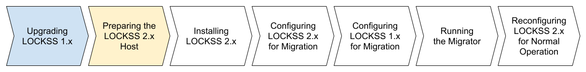

.. include:: subst.rst

==============================
Preparing Your LOCKSS 2.x Host
==============================

econd box labeled "Preparing the LOCKSS 2.x Host" is highlighted in yellow, indicating the step in progress. The last five boxes, successively labeled "Installing LOCKSS 2.x", "Configuring LOCKSS 2.x for Migration", "Configuring LOCKSS 1.x for Migration", "Running the Migrator" and "Reconfiguring LOCKSS 2.x for Normal Operation", are not colored, indicating future steps.

The next task in the migration process is to prepare your LOCKSS 2.x host [#fn-same-host]_.

The necessary work depends on your :ref:`Migration Scenario`:

.. tab-set::

   .. tab-item:: New-Host Migration
      :sync: newhost

      If you are doing a :ref:`New-Host Migration`, you will need to **commission a new host for your LOCKSS 2.x instance**, for example setting up a new physical machine and installing Linux, or spinning up a new Linux virtual machine.

      See the :external+lockss-manual:doc:`introduction/prerequisites` section of the |MANUAL| for guidance about :external+lockss-manual:ref:`Host Prerequisites` (CPU, memory, operating system, etc.), :external+lockss-manual:ref:`Storage Prerequisites` (system storage, operating storage, content storage), and more.

      LOCKSS 1.x was compatible with Linux operating systems in the RHEL family only, but LOCKSS 2.x is compatible with many Linux operating systems; see the :external+lockss-manual:ref:`Operating Systems` appendix of the |MANUAL| for details.

   .. tab-item:: Same-Host Migration
      :sync: samehost

      If you are doing a :ref:`Same-Host Migration` on a **discontinued** operating system in the RHEL family:

      *  CentOS Linux (not to be confused with `CentOS Stream <https://centos.org/>`_)

      *  `CentOS Stream <https://centos.org/>`_ 8 (not to be confused with CentOS Linux)

      *  `EuroLinux <https://euro-linux.com/>`_

      *  `Red Hat Enterprise Linux <https://www.redhat.com/en/technologies/linux-platforms/enterprise-linux>`_ (RHEL) 7 or earlier

      *  `Oracle Linux <https://www.oracle.com/linux/>`_ 7 or earlier

      *  `Scientific Linux <https://scientificlinux.org/>`_

      then you must **upgrade your LOCKSS 1.x host to a supported operating system in the RHEL family version 8 or later** [#fn-same-host]_ [#fn-rhel-8-later]_:

      *  `AlmaLinux OS <https://almalinux.org/>`_ 8 or later

      *  `CentOS Stream <https://centos.org/>`_ 8 or later

      *  `Red Hat Enterprise Linux <https://www.redhat.com/en/technologies/linux-platforms/enterprise-linux>`_ (RHEL) 8 or later

      *  `Oracle Linux <https://www.oracle.com/linux/>`_ 8 or later

      *  `Rocky Linux <https://rockylinux.org/>`_ 8 or later

      before you can co-install LOCKSS 2.x with LOCKSS 1.x. In particular, CentOS Linux (not to be confused with CentOS Stream) was once common in the LOCKSS 1.x user community, and requires an upgrade before installing LOCKSS 2.x.

      The LOCKSS Community Wiki offers a page on `OS Upgrades <https://github.com/lockss/community/wiki/OS-Upgrades>`_, providing guidance on various upgrade paths.

----

.. only:: html

   .. rubric:: Footnotes

.. [#fn-same-host]

   If your :ref:`Migration Scenario` is a :ref:`Same-Host Migration`, your LOCKSS 1.x host and your LOCKSS 2.x host are the same host.

.. [#fn-rhel-8-later]

   Preferably later; as of this writing, version 10 is current.
