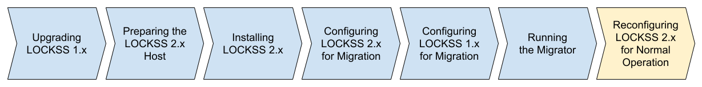

.. include:: subst.rst

=============================================
Reconfiguring LOCKSS 2.x for Normal Operation
=============================================

lling LOCKSS 2.x", "Configuring LOCKSS 2.x for Migration", "Configuring LOCKSS 1.x for Migration", and "Running the Migrator", are colored in light blue, indicating completed steps. The seventh box labeled "Reconfiguring LOCKSS 2.x for Normal Operation" is highlighted in yellow, indicating the step in progress. The last box, labeled "Decommissioning LOCKSS 1.x", is not colored, indicating a future step.

The next task, once all the content has been successfully migrated from LOCKSS 1.x to LOCKSS 2.x, is to reconfigure LOCKSS 2.x for normal operation.

Follow these steps:

1. |LOCKSS1ROOT| Stop your LOCKSS 1.x system. This occurs on your LOCKSS 1.x host, as ``root``:

   .. code-block:: shell

      systemctl stop lockss

2. |LOCKSS2LOCKSS| Stop your LOCKSS 2.x system (currently configured for migration). This occurs on your LOCKSS 2.x host, as the ``lockss`` user, in the :ref:`LOCKSS Installer Directory`:

   .. code-block:: shell

      scripts/stop-lockss

3. This step depends on your :ref:`Migration Scenario`:

   .. tab-set::

      .. tab-item:: New-Host Migration
         :sync: newhost

         If you are doing a :ref:`New-Host Migration`, follow these steps to reconfigure your LOCKSS 2.x instance for normal operation:

         a. Allow your LOCKSS 2.x host to adopt the IP address, and ideally hostname, previously associated with your LOCKSS 1.x host. This step is **strongly recommended**; see :numref:`Adopting the LOCKSS 1.x IP Address and Hostname` (:ref:`Adopting the LOCKSS 1.x IP Address and Hostname`) for details, including a discussion of :ref:`Implications of not adopting the LOCKSS 1.x IP address` and :ref:`Implications of not adopting the LOCKSS 1.x hostname`. This action requires the following steps:

            (i) |LOCKSS1ROOT| Shut down your LOCKSS 1.x host, or at least reconfigure it to yet another IP address.

            (ii) |LOCKSS2ROOT| Reconfigure your LOCKSS 2.x host so it uses the IP address, and ideally hostname, previously associated with your LOCKSS 1.x host.

            (iii) |LOCKSS2ROOT| On the LOCKSS 2.x host, run these two commands as ``root``:

               .. code-block:: shell

                  /usr/local/bin/k3s-killall.sh

                  systemctl restart k3s

               This is necessary for |K3s| to adjust to the newly configured IP address.

         b. |LOCKSS2LOCKSS| Run this command, as the ``lockss`` user, in the :ref:`LOCKSS Installer Directory`:

            .. code-block:: shell

               scripts/configure-lockss

         c. The LOCKSS 2.x configuration process will repeat; for most questions, you will simply hit :kbd:`Enter` to re-accept the previously entered value, **except for the following prompts**:

            (i) :guilabel:`Do you want to reconfigure LOCKSS 2.x to no longer be in migration mode?`: Enter :kbd:`Y` for "yes", or simply hit :kbd:`Enter`.

            (ii) :guilabel:`Fully qualified hostname (FQDN) of this machine`: If you are adopting the LOCKSS 1.x hostname, enter it here (see :ref:`Adopting the LOCKSS 1.x IP Address and Hostname`).

            (iii) :guilabel:`IP address of this machine`: Likewise, if you are adopting the LOCKSS 1.x IP address, enter it here (see :ref:`Adopting the LOCKSS 1.x IP Address and Hostname`).

            (iv) *Optional.* There may be other configuration values you need to change at this stage, but in most cases, everything else will be the same.

            (v) :guilabel:`OK to proceed?`: Enter :kbd:`Y` for "yes", or simply hit :kbd:`Enter`.

         d. If your LOCKSS network uses LCAP SSL keystores for encrypted communication between nodes, see the :doc:`lcap-ssl` chapter.

      .. tab-item:: Same-Host Migration
         :sync: samehost

         If you are doing a :ref:`Same-Host Migration`, follow these steps:

         a. |LOCKSS2LOCKSS| On the LOCKSS host, as the ``lockss`` user, in the :ref:`LOCKSS Installer Directory`, run this command:

            .. code-block:: shell

               scripts/configure-lockss

         b. The LOCKSS 2.x configuration process will auto-repeat, but you will receive a few prompts:

            (i) :guilabel:`Do you want to reconfigure LOCKSS 2.x to no longer be in migration mode?`: Enter :kbd:`Y` for "yes", or simply hit :kbd:`Enter`.

            (ii) :guilabel:`OK to proceed?`: Enter :kbd:`Y` for "yes", or simply hit :kbd:`Enter`.

4. |LOCKSS2LOCKSS| Finally, on the LOCKSS 2.x host, as the ``lockss`` user, in the :ref:`LOCKSS Installer Directory`, run this command:

   .. code-block:: shell

      scripts/start-lockss --wait

   This will start the LOCKSS 2.x stack (now configured for normal operation).
