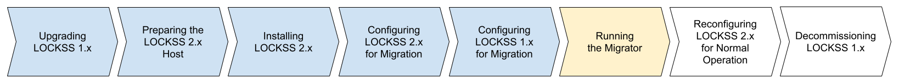

.. include:: subst.rst

====================
Running the Migrator
====================

alling LOCKSS 2.x", "Configuring LOCKSS 2.x for Migration", and "Configuring LOCKSS 1.x for Migration", are colored in light blue, indicating completed steps. The sixth box labeled "Running the Migrator" is highlighted in yellow, indicating the step in progress. The last two boxes, labeled "Reconfiguring LOCKSS 2.x for Normal Operation" and "Decommissioning LOCKSS 1.x", are not colored, indicating future steps.

The next task is to run the migrator in the :guilabel:`Migration Control` screen of your LOCKSS 1.x Web user interface.

You should now be looking at the :guilabel:`Migration Control` screen, after you clicked the :guilabel:`Next` button at the bottom of the :guilabel:`Migration Settings` screen in :numref:`Chapter %s <Configuring LOCKSS 1.x for Migration>` (:ref:`Configuring LOCKSS 1.x for Migration`). Follow these steps:

1. Select the archival units (AUs) you wish to migrate at this time. You have multiple options:

   *  Using the :guilabel:`Select Plugin` dropdown: Select "All Plugins" to migrate all AUs, or select a given plugin to migrate all its AUs.

   *  Using the :guilabel:`Choose File` button: You can upload a text file containing a list of archival unit identifiers (AUIDs) corresponding to the AUs you would like to migrate at this time.

2. Select the desired migration mode:

   *  To copy the each AU's URLs and state information and then apply a verification step to check that the copy was successful, select :guilabel:`Copy and Verify`. **This is the recommended mode.**

   *  To only copy each AU's URLs and state information, select :guilabel:`Copy Content`.

   *  |DRYRUNONLY| If you are doing a :ref:`Dry Run Migration`, you will also have the option to select :guilabel:`Verify Only`, to only verify that already copied AUs match after the fact.

3. If you wish the verification step of the :guilabel:`Copy and Verify` or :guilabel:`Verify Only` modes to additionally perform byte-for-byte comparison of content data, select the :guilabel:`Full content compare` checkbox.

4. Start the migration by clicking the :guilabel:`Start Migration` button at the bottom of the form. (If you are doing a :ref:`Dry Run Migration`, the button is labeled :guilabel:`Start Dry Run Migration` instead.)

   .. tip::

      .. dropdown:: The migration takes time
         :name: The migration takes time
         :icon: light-bulb
         :animate: fade-in-slide-down

         The migration process takes a long time, proportional to the total content size, and impacted by system, network, and storage performance. There may be no apparent progress for a while during migration.

      .. dropdown:: Migration log files
         :name: Migration log files
         :icon: light-bulb
         :animate: fade-in-slide-down

         The migrator writes debugging information to two LOCKSS 1.x log files: :file:`/var/log/lockss/v2migration.txt` and :file:`/var/log/lockss/v2migration.err`.

      .. dropdown:: Stopping the migration in progress
         :name: Stopping the migration in progress
         :icon: light-bulb
         :animate: fade-in-slide-down

         To stop the migration in progress, click the :guilabel:`Abort` button. It may take a moment for the migration to stop.

5. When the migration of the selected AUs ends, you will see ``Status: Done``, possibly followed by the number of AUs that encountered errors during migration, on the first line of the status display. Take time to review the migration results in the status display and the :ref:`Migration log files`.

6. Refresh the page in your browser to reset the counters of active AUs shown in the :guilabel:`Select Plugin` dropdown. Go back to step (1) and repeat the process for additional batches of AUs, until all AUs have been migrated.
