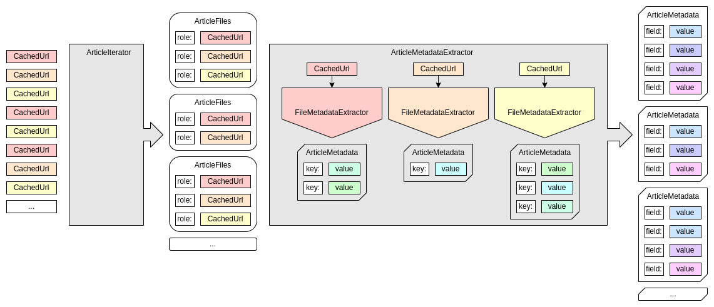

===================================
Introduction to Metadata Extraction
===================================

Once content is successfully crawled into an archival unit (AU) in a LOCKSS node, optionally with the help of hash filters and related plugin features, the AU is preserved by polling and repairing with other nodes in the network holding the same AU. If metadata extraction from preserved data is desired beyond the preservation of the data itself and the **metadata database** is enabled, the plugin needs to specify **metadata extraction** features.

Metadata extraction relies on a trio of related concepts:

*  An :doc:`article-iterator` groups an AU's URLs into one cluster per article ("article" in the sense of "object" or "item").

   The URLs are represented internally as ``org.lockss.plugin.CachedUrl`` objects. The object representing an article's cluster of URLs is of type ``org.lockss.plugin.ArticleFiles``, and is essentially a mapping from string **roles** to URLs.

   An article iterator is merely an object implementing ``java.util.Iterator<ArticleFiles>``, that comes from a factory implementing the ``org.lockss.plugin.ArticleIteratorFactory`` interface.

*  A media type-specific :doc:`file-metadata-extractor` parses the contents of a URL and emits any number of **intermediate metadata records**.

   A file metadata extractor is an object implementing the ``org.lockss.extractor.FileMetadataExtractor`` interface and emitting metadata records of type ``org.lockss.extractor.ArticleMetadata`` through an object implementing the ``org.lockss.extractor.FileMetadataExtractor.Emitter`` interface. The latter is called for each (``CachedUrl``, ``ArticleFiles``) pair, creating a one-to-many relationship from ``CachedUrl`` to ``ArticleFiles``.

*  An :doc:`article-metadata-extractor` receives each article's ``ArticleFiles`` object, and emits any number of **processed metadata records** (of the same type ``ArticleMetadata``).

   An article metadata extractor implements the ``org.lockss.extractor.ArticleMetadataExtractor`` interface and emits ``ArticleMetadata`` objects through an object implementing the ``org.lockss.extractor.ArticleMetadataExtractor.Emitter`` interface. The latter is called for each (``ArticleFiles``, ``ArticleMetadata``) pair, creating a one-to-many relationship from ``ArticleFiles`` to ``ArticleMetadata``.

   The article metadata extractor picks and chooses URLs of interest from the ``ArticleFiles`` instance, invokes the file metadata extractors for the corresponding media types yielding intermediate ``ArticleMetadata`` objects, and emits appropriate final ``ArticleMetadata``  objects from them.

Although in principle there are file metadata extractors for multiple media types, a one-to-many relationship from ``CachedUrl`` to ``ArticleFiles`` in file metadata extractors, and a one-to-many relationship from ``ArticleFiles`` to ``ArticleMetadata`` in article metadata extractors, in many situations plugins derive all the metadata they need from a single media type, there is a one-to-one-to-one correspondence between a ``CachedUrl``, ``ArticleFiles`` and ``ArticleMetadata`` triple, and the intermediate metadata records can often be emitted as final metadata records.

This process can be summarized in the following diagram:

